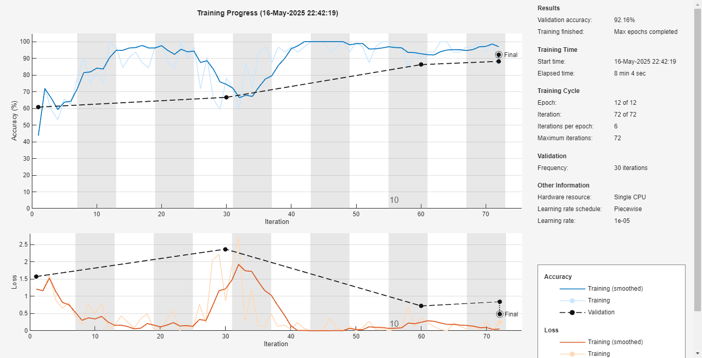
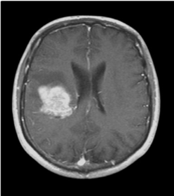

# Brain Tumor Detection using MATLAB (ResNet-18)

This MATLAB project uses a fine-tuned ResNet-18 deep learning model to classify MRI brain scans as having a tumor or not. It includes training, testing, and a GUI for easy interaction.

---

## 📁 Project Structure

Brain_tumor_detection/
├── brain_tumor_models/
│ ├── brain_tumor_resnet18_model/ # Trained model and network layers
│ ├── brain_tumor_training/ # Training script and dataset handling
│ ├── brain_tumor_testing/ # Testing and evaluation script
│ └── brainTumorDetectionGUI.m # GUI application
├── images/
│ ├── mri1.jpg # MRI test image
│ ├── mri2.jpg # MRI test image
│ └── training_sample.png # Snapshot of training process
├── .gitignore
└── README.md

---

## 🚀 How to Run

1. Open `brainTumorDetectionGUI.m` in MATLAB.
2. Run the GUI and upload an MRI image to classify.
3. View the classification result in the GUI.

> Alternatively, you can run training and testing scripts separately from the `brain_tumor_training` and `brain_tumor_testing` files.

---

## 🧠 Model

- Architecture: ResNet-18
- Transfer learning applied on a custom MRI brain tumor dataset
- Trained using MATLAB's Deep Learning Toolbox

---

## 🖼️ Sample Images

- MRI test images and training snapshots are available in the `images/` folder:

---

## 📦 Requirements

- MATLAB R2021a or later
- Deep Learning Toolbox
- Image Processing Toolbox

---

## 🧑‍💻 Author

**Rahul K S**
